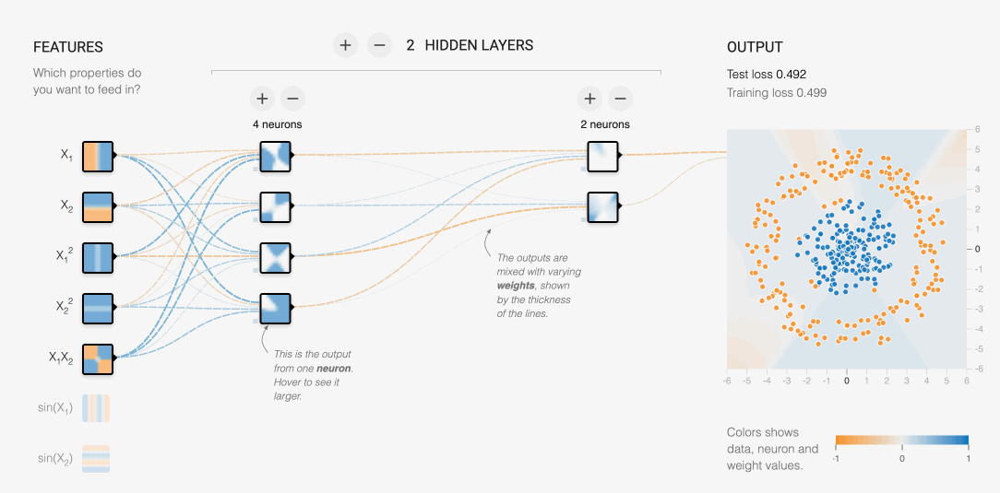
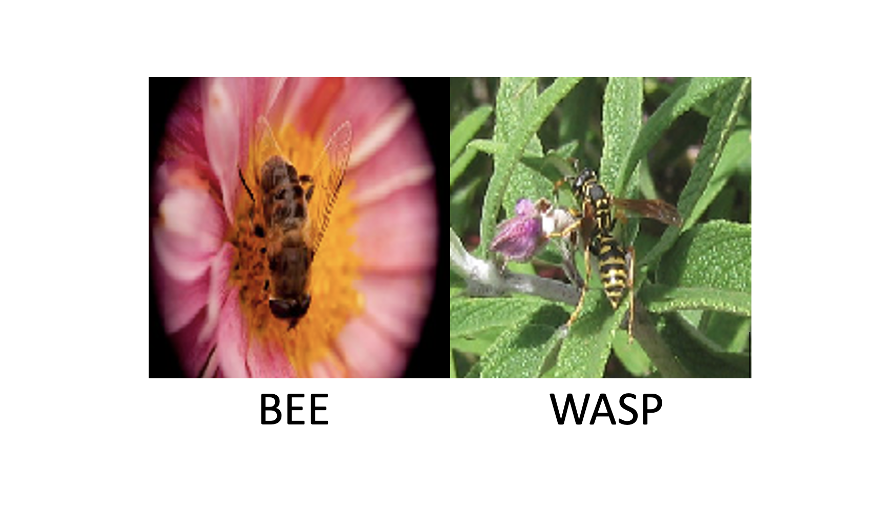

_This is a compilation of my notes and insights from my participation in week 8 of the [Machine Learning ZoomCamp](https://mlzoomcamp.com/)_

## What is Deep Learning?

One of my goals when starting the [Machine Learning ZoomCamp](https://mlzoomcamp.com/) was to gain a better understanding of the fundamentals underpinning the recent advances in Machine Learning and Generative AI. I was therefore excited to start week 8 which introduced Tensorflow and Keras, two libraries that are essential to deep learning research and training.

At its core, deep learning is a set of techniques used to build some of the most advanced neural networks - which are biologically-inspired machine learning models. Models built with these techniques are built of multiple "layers" which transform an input by passing it through each layer to identify patterns or features.

# Building a simple neural network using deep learning

For the [homework](https://github.com/Tadwork/MLZoomCampSolutions/blob/main/week8/homework.ipynb) I built a simple convolutional neural network using Keras to identify if an image showed a bee or wasp using the [this](https://www.kaggle.com/datasets/jerzydziewierz/bee-vs-wasp) dataset from Kaggle. This simple model could be defined using only a few lines of code to take the 150x150 RGB input images in the training set and pass them through a 2D convolutional layer that would create 32 filters of 3x3 pixels and a 64 neuron dense layer to end up with a binary classification determining if the image contained a bee or a wasp.

In order to train the model I passed in some parameters to create more data for the neural network through data augmentations and then trained the model for 10 epochs.

While the final accuracy isn't spectacular, achieving at most 79% accuracy on the test set, I was still impressed how little effort and computation was required to build this model.  

## Additional learning

I would be remiss if I didn't mention Jeremy Howard's fantastic deep learning [course on fast.ai](https://course.fast.ai/). I plan on spending more time exploring this course and the [book](https://course.fast.ai/Resources/book.html)

The [Keras docs](https://keras.io/) were also surprisingly well organized and easy to navigate. There is a lot there for anyone looking to get a better understanding of the state of the art in deep learning including api documentation, guides, and fully featured examples.

[Stanford's CS231](https://cs231n.github.io/) is another great resource that is quoted frequently in the ZoomCamp videos and I hope to dive into this more over the next few weeks.

Lastly, the [Tensor Flow Playground](https://playground.tensorflow.org/) and Google's [Teachable Machine](https://teachablemachine.withgoogle.com/) are great tools for playing around with the concepts and ideas required for building deep learning models and really helped build a better intuition about.