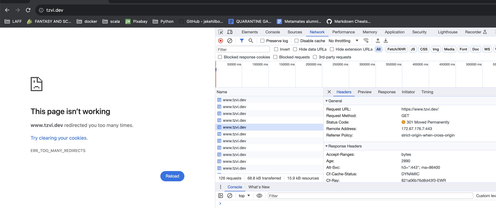
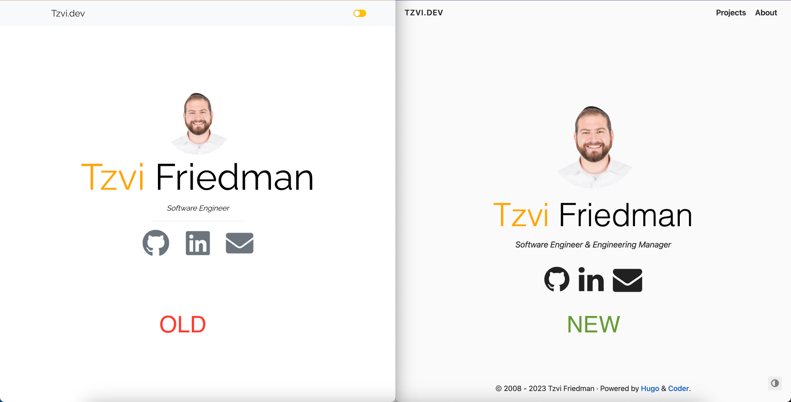

## Trying to revive the old version

Earlier this month I revisited [my personal website](https://www.tzvi.dev) to see if I could resurrect it after a 2+ year hiatus. The site's most recent iteration had been based on the Gatsby CMS which is a React based framework for developing static web sites. At the time, this was a great choice since I was very familiar with React and Typescript.

Unfortunately this decision did not age well. When I tried to re-install the dependencies 2 years later I was met with errors such as...

```
npm ERR! Could not resolve dependency:
npm ERR! peer eslint-plugin-react-hooks@"1.x || 2.x" 
...
```

Trying to fix this by choosing different dependencies only led me further down dependency hell.

This phenomenon, where unmaintained code becomes impossible to deploy if not updated periodically, is sometimes referred to as bit-rot because the code deteriorates on its own over time. After a brief struggle, it quickly became apparent that I could spend my time more effectively by replacing the Gatsby version with something which had less dependencies.

## Introducing Hugo


After doing some quick research I settled on [Hugo](https://gohugo.io/) as a replacement for Gatsby. Hugo is a static site generator written in the Go programming language. On its home page the authors make the claim that using it will "make building websites fun again." While there wasn't an automatic conversion from Gatsby to Hugo I quickly found a minimalistic theme that I could easily customize to match the previous design.

I quickly realized how powerful Hugo is once I installed the theme. When using Hugo a theme is installed by adding a git submodule, so it was easy to dive into the theme source code if I wanted to understand it better. If I needed to make any customizations I simply had to create a parallel copy of the file in my source code and making some changes.

During development I simply ran the command `hugo server --buildDrafts` to build a local version of the site which auto updated on every change to source files. Once I was satisfied I turned to [this simple guide](https://gohugo.io/hosting-and-deployment/hosting-on-github/) which walked me through the steps to add a Github Action as a source for the final Github Pages build.

## Too many redirects



After completing the transition I took the opportunity to transfer the domain from Google Domains to Cloudflare. Cloudflare offers additional features on top of DNS and domain hosting including DDOS mitigation by adding a caching layer on top of web sites that can help prevent sites from being overwhelmed. Additionally, Cloudflare offers additional security focused options such as [Always use HTTPS](https://developers.cloudflare.com/ssl/edge-certificates/additional-options/always-use-https/) which redirects all visitor requests from http to https for all subdomains and hosts.

While I had this option turned on originally, not anticipating any downsides, I quickly realized that it didn't play well with the web hosting I was using at Github Pages and AWS CloudRunner which already served the page as HTTPS and was therefore getting pushed into a [Redirect Loop](https://developers.cloudflare.com/ssl/troubleshooting/too-many-redirects/). Once I turned off the option to "Always Use HTTPS" on the Cloudflare console the redirect loop went away and routing worked as expected.

## Results



As you can see from the screenshot above, the old and new site are actually pretty similar. Now that the transition is done, I am pretty happy with the results and would highly recommend Hugo due to its versatility and user friendliness.

The sites full source code is available on [Github](https://github.com/Tadwork/tzvi.dev) for anyone who wants to get a closer look.