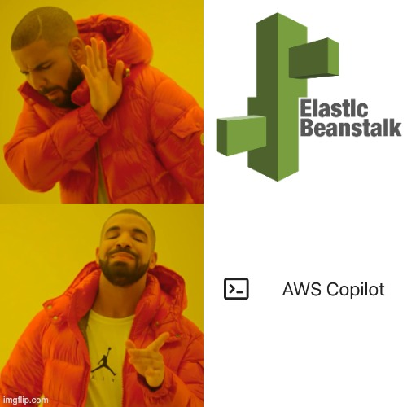

I recently needed to create a web service and deploy it to a publicly available cloud hosting platform. Since AWS had been my goto for the past few years I turned there first to see if there was an easy way to get started easily.

## Elastic Beanstalk

Years ago I had used Elastic Beanstalk to spin up an environment and I turned to that first. Once I began using it though, I quickly realized that Elastic Beanstalk wasn’t going to be as simple as I was hoping it would be. [I started by installing the CLI](https://github.com/aws/aws-elastic-beanstalk-cli-setup) and created a simple configuration using the docker mode to create a simple docker container and expose it to the public internet.

```
{
  "AWSEBDockerrunVersion": "1",
  "Image": {
    "Name": "your-docker-image-name",
    "Update": "true"
  },
  "Ports": [
    {
      "ContainerPort": "9696"
    }
  ]
}
```

Once that was done, I tried running 

```
eb init -p docker midterm-laptop-price-prediction 
```

to create the stack and unfortunately this failed on build with an `Out of Memory Error`.


Ok, so I need to make sure that the instance that is created has a higher memory allocation, but you can’t specify that in the v1 Elastic Beanstalk configuration. 

Instead I tried switching to the v2 Elastic Beanstalk configuration. This version uses the docker compose syntax, can create multiple services, and allows the user to specify the minimum memory size as part of that configuration. After creating that configuration file in the following format:

```
{
  "AWSEBDockerrunVersion": 2,
  "containerDefinitions": [
    {
      "name": "my-container",
      "image": "my-image",
      "memory": 1024,
      "cpu": 1,
      ...
    }
  ],
  ...
} 
```

I tried bringing this version up with 

```
eb init -p ecs midterm-laptop-price-prediction 
```

and while it created a lot of infrastructure including an ECS Cluster, Elastic Load Balancer, S3 Bucket, VPC, etc. it still failed to start the service. Even more frustratingly, I couldn’t figure out why it was failing and there didn’t seem to be any logs showing why anywhere I looked. After trying multiple times I finally gave up when it created the maximum number of VPC’s in my account and I tried looking for another solution.



## AWS Copilot

While I was searching around the AWS console I noticed a link to an AWS product that I had never heard of before with the unfortunate name of AWS Copilot. This product sold itself by claiming it can be used to "quickly launch and manage containerized applications on AWS." I figured I had nothing to lose trying it so I went to [install the AWS Copilot CLI](https://docs.aws.amazon.com/AmazonECS/latest/developerguide/AWS_Copilot.html) as instructed and followed the instructions to run a single command:

```
copilot init --app midterm --name laptop-price-prediction --type 'Request-Driven Web Service' --dockerfile './Dockerfile' --port 9696 --deploy
```

**_That worked!_**

After exploring the AWS Copilot interface I found a way to create a link directly to the project I was working on https://laptop-price-prediction.tzvi.dev/ which was a Laptop Price Prediction model I built for the [ML Zoomcamp](http://mlzoomcamp.com/) course.

As a bonus, [AWS Copilot's documentation](https://aws.github.io/copilot-cli/) is surprisingly well designed and easy to navigate which means that I can easily turn to it for more complex needs in the future. 

## Bonus: Render.com

One tradeoff of both AWS Copilot and AWS Elastic Beanstalk is that they are just abstractions on top of the AWS architecture. This means that if something goes wrong, or if destroying the environment doesn’t work perfectly, you may be left with random pieces of dangling infrastructure. For example, I discovered that even after running copilot app delete I still had Route53 hosted zones that were left running (at $0.50 each).

An alternate approach which was even simpler to get running would be to use a fully managed platform like [render.com](https://www.render.com) . I ended up connecting to, and deploying the exact same infrastructure to Render and it was completely seamless and user friendly. If asked to do this again, I would probably recommend Render to anyone looking to deploy a simple cloud hosted web service. The only downside I experienced with Render is that the free plan has very low powered instances, and spins them down when not in use, so it was a less than optimal user experience for my use case where I wanted to share the service and get feedback.

## Summary

Creating publicly available cloud hosted infrastructure for a web service is still surprisingly difficult in 2023. After evaluating [render.com](https://www.render.com), AWS Copilot, and AWS Beanstalk I would recommend [render.com](https://www.render.com) for the simplest use cases and AWS Copilot for anything moderately complex.

_This article was originally posted on [LinkedIn](https://www.linkedin.com/pulse/simple-cloud-hosted-web-services-2023-tzvi-friedman-iexee)_
