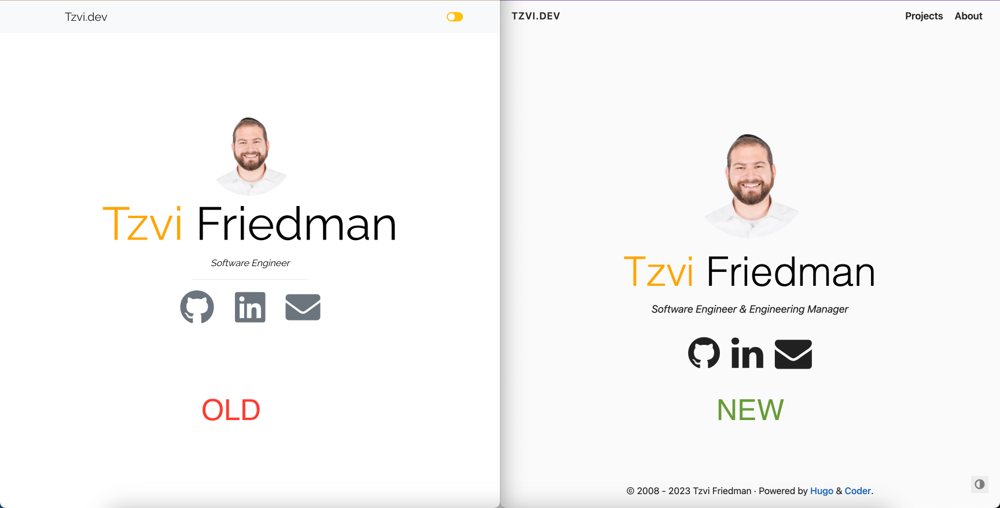

## Trying to revive the Gatsby version

Earlier this month I revisited my personal website to see if I could resurrect it after a 2+ year hiatus. The site's most recent iteration had been based on the Gatsby CMS which was a React based framework for developing static web sites. This was a great choice at the time since I was very familiar with React and Typescript and felt comfortable using them as teh base for the new site. I chose a theme that felt both minimalistic and modern and that would allow me to expand to add a blog or other content when I had the time.

Unfortunately this decision did not age well. When I tried to re-install the dependencies 2 years later I was met with errors claiming that 

## Too many redirects

While completing the transition of this site from Gatsby to Hugo I took the opportunity to transfer the domain from Google Domains (which was shutting down) to Cloudflare. Cloudflare offers additional features on top of dns and domain hosting since it provides a caching layer on top of web sites that can help prevent sites from being overwhelmed. It also offers additional security focused options such as [Always use HTTPS](https://developers.cloudflare.com/ssl/edge-certificates/additional-options/always-use-https/) which redirects all visitor requests from http to https for all subdomains and hosts. 

WHile I had this option turned on originally, not anticipating any downsides, I quickly realized that it didn't play well with the web hosting I was using at Github Pages and AWS CloudRunner which already served the page as HTTPS and was therefore getting pushed into a [Redirect Loop](https://developers.cloudflare.com/ssl/troubleshooting/too-many-redirects/). Once I turned off the option to Always Use HTTPS on the Cloudflare console the redirect loop went away and routing worked as expected.

## Results

